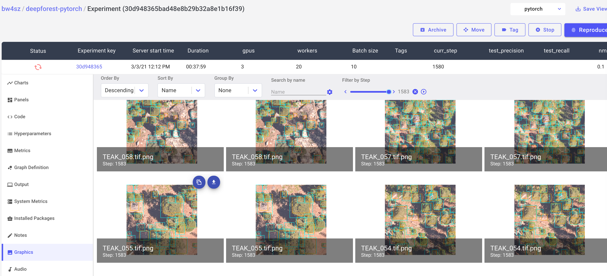
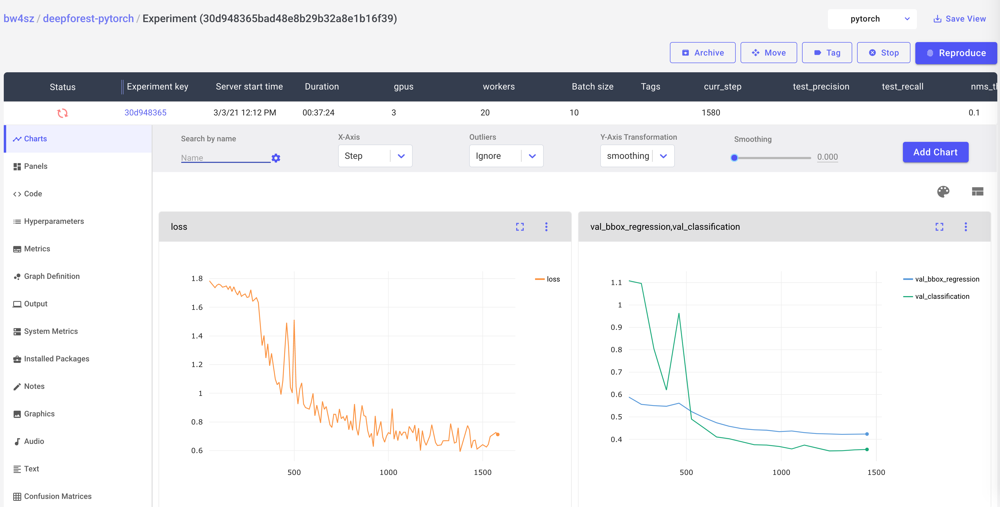

# DeepForest Release Model 

This repo is for training DeepForest deep learning models following: 

Weinstein, B.G.; Marconi, S.; Bohlman, S.; Zare, A.; White, E. Individual Tree-Crown Detection in RGB Imagery Using Semi-Supervised Deep Learning Neural Networks. Remote Sens. 2019, 11, 1309. https://doi.org/10.3390/rs11111309
https://www.mdpi.com/2072-4292/11/11/1309

DeepForest: A Python package for RGB deep learning tree crown delineation
BG Weinstein et al. - Methods in Ecology and Evolution, 2020

Ben G. Weinstein, Sergio Marconi, Stephanie A. Bohlman, Alina Zare, Ethan P. White,
Cross-site learning in deep learning RGB tree crown detection,
Ecological Informatics-
Volume 56, 2020,

This repo is primarily designed for members of the idtrees collaboration at the University of Florida, but anyone is welcome to request the data. The following paths related to a shared workspace on UF supercomputer and would need to be updated.
The general workflow is to 

1. Fork this repo.
2. Generate training data from annotations.
3. Test a new tree crown detection model.
4. Submit an evaluation score against the NeonTreeEvaluation benchmark

It is highly recommended to use comet_ml for data visualization. The following graphics and instructions assume you have created a free account. 
Sample SLURM submission scripts are in SLURM/, but the user accounts would need to be updated.

# Installation

This repo uses conda to manage dependencies.

```
conda env create -f = environment.yml
conda activate deepforest_pytorch
```

# Create training data

Annotations were made using large rasters and need to be cut into smaller pieces to fit within memory. This creates the needed datasets structure to feed into the model within GPU memory.

Open up generate.py and supply locations of the sensor and benchmark data. Defaults to shared workspaces within the group.

```
python generate.py
```

# Train a new model


DeepForest-pytorch is documented https://deepforest-pytorch.readthedocs.io/en/latest/. To use the latest release model

```
from deepforest import main
m = main.deepforest()
m.use_release()

print(m.model)
```

## Model config

Training hyperparameters are read from a config file.
```
cat deepforest_config.yml
```

```
# Config file for DeepForest-pytorch module

#cpu workers for data loaders
#Dataloaders
workers: 20
gpus: 3
distributed_backend: ddp

batch_size: 10
nms_thresh: 0.1
score_thresh: 0.1
train:
    csv_file: /orange/ewhite/b.weinstein/NeonTreeEvaluation/hand_annotations/crops/hand_annotations.csv
    root_dir: /orange/ewhite/b.weinstein/NeonTreeEvaluation/hand_annotations/crops/

    #Optomizer  initial learning rate
    lr: 0.001

    #Print loss every n epochs
    print_freq: 1
    epochs: 30

    #Useful debugging flag in pytorch lightning, set to True to get a single batch of training to test settings.
    fast_dev_run: False

validation:
    #callback args
    csv_file: /home/b.weinstein/NeonTreeEvaluation/evaluation/RGB/benchmark_annotations_with_header.csv
    root_dir: /home/b.weinstein/NeonTreeEvaluation/evaluation/RGB/
    project: True
    #Intersection over union evaluation
    iou_threshold: 0.4
```

and are documented 

https://deepforest-pytorch.readthedocs.io/en/latest/training_config.html
Note that for hipergator, you need to both set the number of gpu in config and correctly request atleast that many GPUs from SLURM.

```
python train.py
```

Once you have configured comet_ml you will automatically log all metrics and [visualizations](https://www.comet.ml/bw4sz/deepforest-pytorch/30d948365bad48e8b29b32a8e1b16f39?experiment-tab=chart&showOutliers=false&smoothing=0&transformY=smoothing&viewId=RhhMXsRA1UdsXTxZv13D7WJ8e&xAxis=step). You will need to edit the api key at the top of train.py

```
comet_logger = CometLogger(api_key="######",
                              project_name="#####", workspace="####")
```





The official benchmark score is given by the metric "test_recall" and "test_precision"
